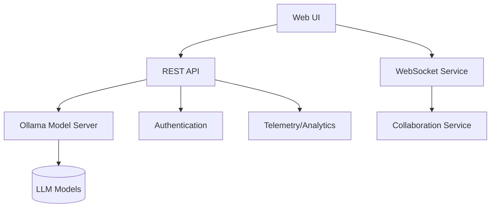

# Developer Documentation

## Architecture Overview

Watsonx Code Assistant uses a modern architecture combining client-side JavaScript with Python backend services:



### Key Components

#### Frontend
- **Main UI** (`index.html`, `assets/js/main.js`): Core dashboard interface
- **Authentication** (`assets/js/auth.js`): Handles user authentication and permissions
- **Collaboration** (`assets/js/websocket.js`, `assets/js/collaboration.js`): Manages real-time collaboration features
- **Code Review** (`assets/js/codeReview.js`): Handles code analysis and suggestions 
- **Telemetry** (`assets/js/telemetry.js`): Collects anonymized usage data

#### Backend
- **API Server**: Python Flask application serving REST endpoints
- **Ollama Integration**: Manages communication with local LLM instances
- **WebSocket Server**: Handles real-time communications
- **Model Management**: Handles model downloads, updates, and optimization

## Development Environment Setup

### Prerequisites
- Node.js 16+
- Python 3.10+
- Docker and Docker Compose
- VS Code with recommended extensions

### Local Setup

1. Clone the repository:
   ```bash
   git clone https://github.com/IBM/watsonx-code-assistant-individual.git
   cd watsonx-code-assistant-individual
   ```

2. Install dependencies:
   ```bash
   # Frontend dependencies
   npm install
   
   # Backend dependencies
   python -m venv venv
   source venv/bin/activate  # On Windows: venv\Scripts\activate
   pip install -r requirements.txt
   ```

3. Start development servers:
   ```bash
   # Start backend API
   python start_ui_server.py
   
   # In another terminal, start Ollama (if not using Docker)
   ollama serve
   ```

4. Access the UI at http://localhost:5000

## Code Organization

